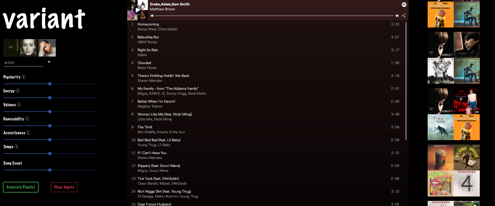
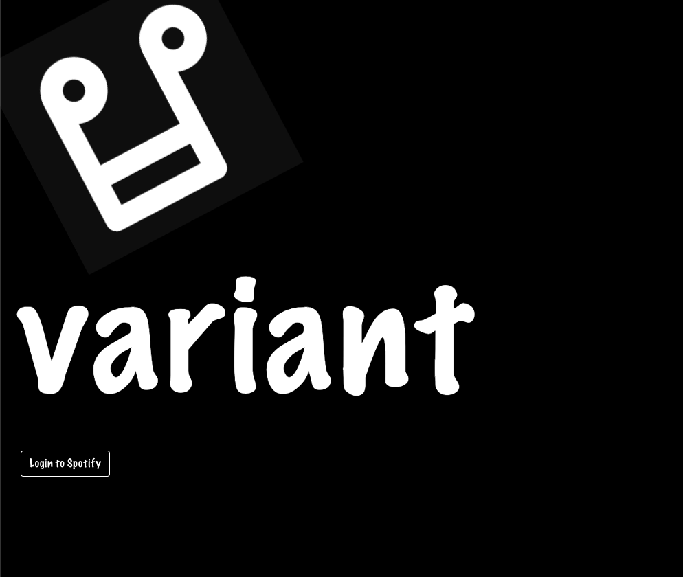

# variant.

variant. is a playlist generator using the Spotify Developer API. A user, once authorized with Spotify login, can enter up to five artists and set a number of parameters to create an incredible playlist. They can listen to this playlist directly on variant, and it is also automatically added to their Spotify account.

Deployed Site: https://www.thevariantmusic.com/

### variant. in action

## Tech Used

React (ES6, Hooks), Spotify API, Axios

### Login

